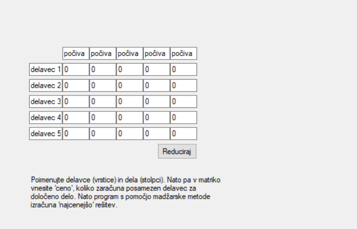
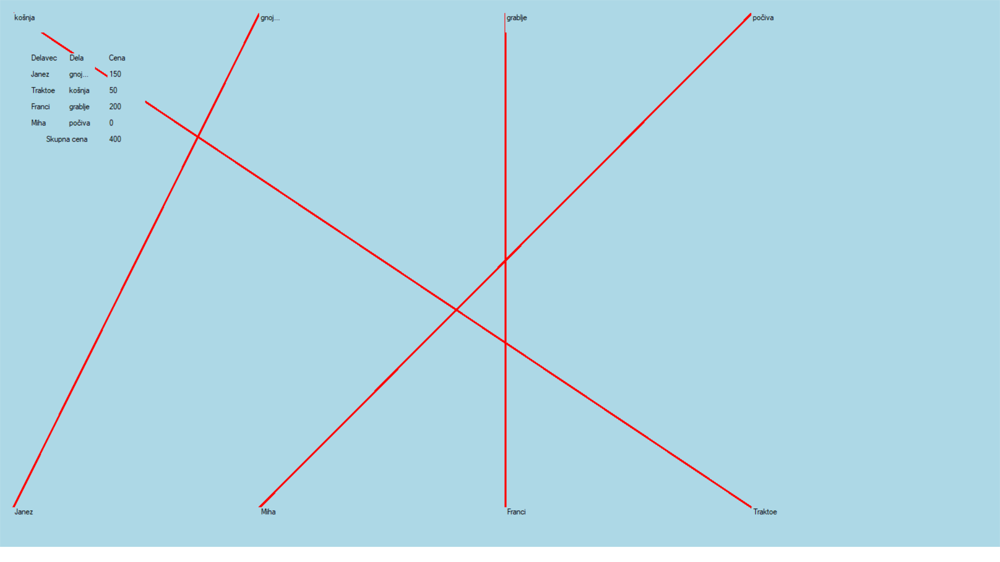

# Tema: Najcenejše popolno prirejanje opravil in madžarska metoda z utežmi

  

Tu lahko uporabnik nastavi velikost problema, program bo avtomatsko napravil tabelo ustrezne velikosti in okoli še prostor za poimenovanje vrstic (delavcev) in stolpcev (opravil). Vsebino matrike avtomatsko postavi vse na 0, vsebino znotraj celice nastavi sam. Potrebno je, da so vrstice "polno" zasedene, stolpci pa so lahko tudi prazni (saj imamo lahko več delavcev kot opravil). 
Na tej strani je tudi gumb reduciraj, ki ob pritisku nanj avtomatsko naredi redukcijo matrike najprej po vrsticah, nato pa še po stolpcih (če se podatkov ne da reducirati, prepiše original). 
Če program že tu odkrije popolno prirejanje, zaključi z izvajanjem.  

  

Drugače pa pritisnemo na gumb madžarska metoda: 

  

Označi pokritje in tudi označi epsilon in ga tudi posebaj izpiše. Nato program avtomatsko bodisi prišteje bodisi odšteje epsilon na ustreznih mestih. To izvede počasi in tako, da označi kje je, zato da človek lažje spremlja in preverja, če razume.    

  

Tako pokaže, ko najde najcenejše popolno prirejanje. V novem oknu pa odpre še rezultat grafa. 

  

Taka razporeditev del ni enolična, povedano drugače, lahko obstaja več prirejanj z isto ceno. Zagotovo pa je končna cena minimalna.

## Viri
- zapiski pri predmetu optimizacija
- C# dokumentacija