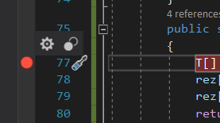
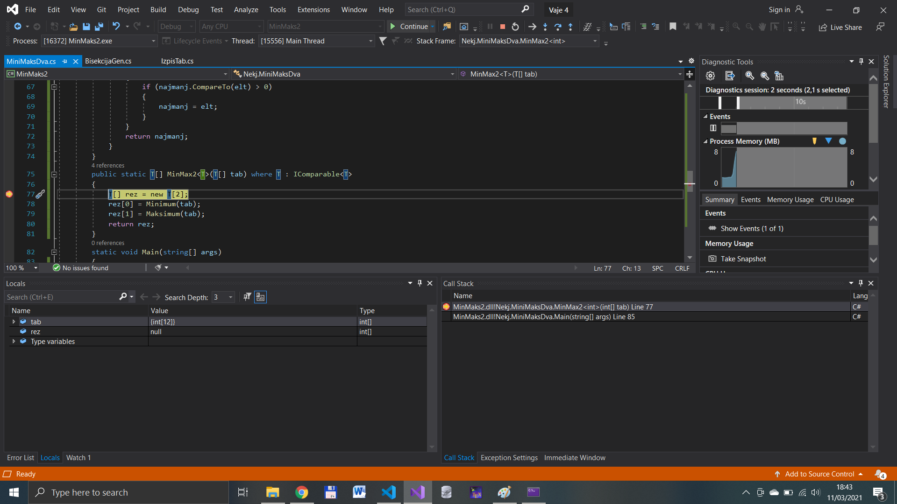
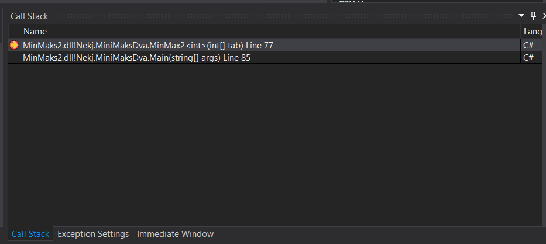
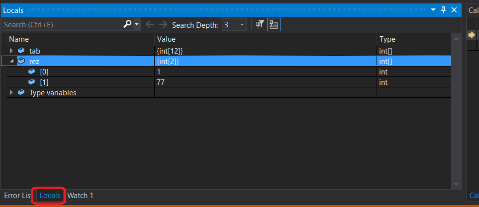
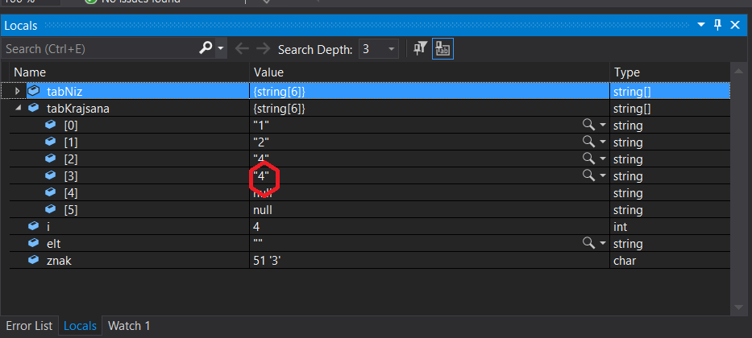
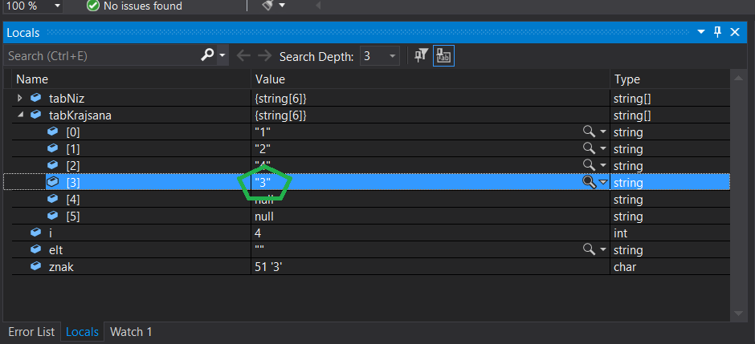
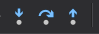
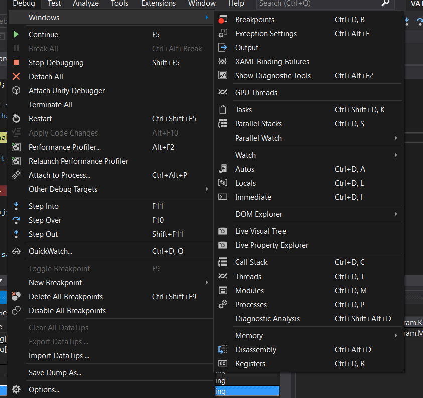

# Razhroščevanje 

**Ime:** Matej Čušin

**Datum:** 9. 3. 2021.

Predstavil sem razhroščevanje (angleško debugging) v okolju Visual Studio.

Za razhroščevanje moramo najprej "postaviti točko preloma" (breakpoint) v Visual Studio. To lahko naredimo na več načinov.  
1) Prvi je ta, da pritisnemo v stolpec levo od številke vrstice, v kateri želimo imeti točko.   

  

2) Druga možnost pa je, da se postavimo kamorkoli v želeno vrstico in pritisnemo `F9`.  

Potem pa lahko zaženemo razhročevanje tako, da pritisnemo `F5`, lahko pa tudi s pritiskom na gumb z znakom `play`, saj je nastavljeno (`default-u`), da se avtomatsko zažene razhroščevalnik, odpre se nam tako okno:  

  

Na desni strani se odpre tabela, ki kaže seznam vseh funkcij, katere smo uporabili. Z dvoklikom na katerokoli funkcijo nas Visual Studio prestavi na izbrano funkcijo. Z rumeno puščico je označen položaj, kjer se nahajamo. 

  

Na levi strani program že avtomatsko ponudi več tabel. Meni je najbolj všeč tabela `Local`, zato je tudi ta označena na spodnji sliki.  

  

Uporabna zna biti tudi tabela `Watch`, sploh če imamo spremenljivk toliko, da so v `Local` zelo teško nadzorovane. Tako lahko nastavimo v `Watch` zgolj tiste spremenljivke, ki nas res zanimajo, in je tako bolj pregledno.

Uporabno je tudi to, da se lahko med samim izvajanjem vmešamo, če se nam zdi, da bi spremenljivka morala imeti drugačno vrednost, in tako preverimo, če program od tam naprej deluje pravilno. Vrednost spremenimo tako, da dvakrat kliknemo na vrednost spremenljivke (označeno na sliki). 

 

Moramo pa se zavedati, da s tem programa samega nismo nič spremenili, saj nismo spremenili kode!  

Po razhroščevalniku se premikamo z naslednjimi ukazai . Prvi gumb je ukaz `Step Into (F11)` - s tem ukazom vstopimo v funkcijo v vrstici, v kateri smo trenutno (vrstico, v kateri smo, pa označuje rumena puščica levo od številčnice). Drugi gumb je ukaz `Step Over (F10)` - s tem ukazom preskočimo "počasno" izvajanje funkcije. To je zelo uporabno, saj imamo napako lahko le v 1 od 100 funkcij in nam med razhroščevanjem ni potrebno vstopiti v vsako. Funkcija se izvede v ozadju in če vidimo, da je v funkciji prišlo do napake, le kazalec (rumeno puščico) z miško prestavimo nazaj v tisto vrstico in vstopimo v funkcijo. Tretji gumb je ukaz `Step Out (Shift+F11)` - s tem ukazom zapustimo funkcijo, v kateri se nahajamo, oz skočimo do naslednje točke preloma v tej funkciji. 

Prav tako Visual Studio ponuja ogromno dodatnih / drugačnih nastavitev, do le teh lahko dostopimo tako, kot kaže spodnja slika. 

 

Precej uporaben se mi zdi ukaz, s katerim odstranimo vse točke preloma hkrati `Ctrl+Shift+F9` oziroma v tem meniju pritisnemo bodisi `Delete  All Breakpoints` bodisi `Disable All Breakpoints`.

